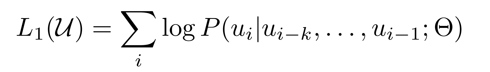

# GPT 논문요약

Date: Apr 8, 2021 → Apr 11, 2021  
Assign: 김유진, @seoromin, 한유경, @rod-y, @jayleenym  
Status: Completed

> 논문 정리 역할 분담
> 1 ~ 2  김유진 
> 3.1 ~ 3.2 @rod-y  
> 3.3 ~ 4.1 @seoromin  
> 4.2 @jayleenym  
> 5 ~ 6 한유경

# 1. Introduction
대부분의 딥러닝 모델은 labeled된 데이터를 바탕으로 지도학습을 하는데, 이는 레이블이 지정되지 않은 데이터(unlabeled data)보다 훨씬 적은 수이기 때문에 unlabeled data의 언어 정보를 활용한다면 훈련에 필요한 시간과 비용을 절약할 수 있다. 

but, unlabeled data에 대하여 단어 수준 이상의 정보를 활용하는 것이 힘든 이유는 크게 두가지 문제점 때문이다. 

1.  어떤 목적함수(optimization objective)가 효과적인지 알 수 없다.
2. 모델에서 학습된 표현(representation)을 다양한 NLP task로 transfer하는데 가장 효율적인 방법이 정해지지 않았다.

본 논문에서는 `unsupervised` pre-training + `supervised` fine-tuning을 결합한 semi-supervised된 접근법을 다룬다. → 미세한 조정만 거치면 광범위한 task에 보편적으로 적용할 수 있는 universal한 representation을 학습하는 것이 이 모델의 목표!

제안하는 모델은 2단계로 나뉘어지는데 

- 1단계 : 신경망의 초기 매개변수를 학습(pre-trained)하기 위해 unlabeled data에 언어 모델링 목적함수(language modeling objective)를 사용. → 이 목적함수에 대해서는 뒤에서 자세히 수식이 나옴.
- 2단계 : 이렇게 얻은 parameter를 supervised objective를 사용하여 fine-tuning한 후 특정한 task에 적용시킴.

또한, 해당 모델에서는 Transformer 구조를 사용했는데, 다양한 task에서 잘 작동할 뿐만 아니라 텍스트의 길이가 길어지면, 효과가 안 좋아지는 (long term memory dependency) RNN 구조의 문제점도 해결할 수 있기 때문이다. → Transformer의 스타일 덕분에 사전 학습된 모델의 아키텍처를 최소한으로 변형하면서 효과적으로 fine-tuning이 가능하다. 

네 가지 유형의 language understanding task에 대한 평가를 수행했고, 범용모델이 각 작업에 특화된 모델의 성능을 능가했음. 

# 2. Related work

**Semi-supervised learning for NLP**

지난 몇년간 연구자들은 unlabeled된 말뭉치가 다양한 과제에서 성능을 향상시켜 줄 것이라는 장점을 발견했지만, 그동안은 주로 단어 수준 표현을 학습할 뿐이었다. 최근의 연구는 unlabeled data로부터 단어 수준 이상(문장수준, 구 수준)의 임베딩으로 정보를 학습하려 하고 있다. 

**Unsupervised pre-training**

목표가 지도학습 목적함수를 수정하는 것이 아닌 좋은 초기화 지점을 찾는 것일 때, 비지도 사전학습은 준지도학습의 특별한 경우가 된다. 후속연구에서 사전학습이 정규화처럼 동작하게 함이 알려지면서 다양한 분야에 활용되고 있다.

GPT와 가장 유사한 연구는 신경망을 언어모델링 목적함수를 사용하여 사전학습시키고 지도 학습으로 목표 과제에 맞춰 미세조정하는 것을 포함하고 있다. 하지만, 이들 모델의 pre-training하는 구간이 언어적 정보를 포착하는데 있어 도움을 주긴 하지만 LSTM의 사용으로 인해 예측이 좁은 범위에 한정된다. GPT는 Transformer를 사용함으로써 넓은 범위에 걸친 언어적 구조와 정보를 학습할 수 있게 하였고, 나아가 다양한 과제에 사용할 수 있게 되었다.

**Auxiliary training objectives**

보조 학습 목적함수(auxiliary objective)를 추가하는 것은 준지도학습의 대안적인 형태이다. 이를 추가하여 여러 연구에서 성능 향상을 목격하였고, 본 연구에서도 auxiliary objective를 사용하지만, 이미 unsupervised pre-training 단계에서 여러 언어적 특징들을 학습한걸 확인할 수 있었다. 

# 3. Framework

학습은 두 단계로 구성됨. 
1. 대규모 텍스트 말뭉치에서 대용량 언어 모델 학습하는 것
2. fine-tuning 단계로, 라벨링된 데이터를 사용하여 discriminative task에 모델을 적용

## 3.1 Unsupervised pre-training

레이블링 되지 않은 말뭉치의 tokens U = {u1, . . . , un}가 주어지면, standard LM을 사용해 다음과 같은 likelihood를 최대화하는 방향으로 학습 진행

약
식 1) k=윈도우 크기, P=파라미터 θ에 대해 계산됨, 모든 파라미터는 SGD방식으로 학습됨.

transformer의 변형 중 하나인 multi-layer transformer decoder를 사용!
multi-headed self-attention 연산을 모든 입력 토큰에 대해서 수행하고, 해당 결과를 position-wise feedforward layer의 입력으로 제공

식 2) U=token의 context vector, n=레이어의 개수, W_e=토큰을 임베딩하는 matrix, W_p=position embedding matrix

(처음 h_0에는 필요한 해당 token을 position embedding으로 순서 값을 정해줌 → 계속해서 transformer_block에 넣어줘서 학습을 진행 → 결과 P(u)는 학습된 마지막 값을 행렬곱하여 text dictionary만큼의 softmax로 다음 단어를 뽑아냄)

## 3.2 Supervised fine-tuning

위의 식 1을 통해서 pre-training을 하고 나서, 학습된 파라미터는 target task에 맞게 fine-tuning함.

레이블링된 데이터셋 C를 사용한다고 가정하고 이는 입력 x1,x2,...,xm과 레이블 y로 구성됨

입력들은 pre-trained 된 모델의 입력으로 제공되고 마지막 transformer block의 출력인 h_l_m으로 출력됨. 
이 출력은 W_y를 파라미터로 하는 linear output layer의 입력으로 제공되어 y(=레이블)를 예측하게 됨.

식 3)

식 4를 최소화하도록 학습

식 4)

Language modeling을 fine-tuning 과정에서 보조 objective로 사용했을 때 ,supervised model의 generalization을 향상 + 빠르게 수렴할 수 있도록 함. 

weight λ에 대해 식 5와 같은 방식으로 최적화 진행

식 5)

⇒ Fine-tuning 과정에서 추가적으로 필요한 파라미터는 linear output layer를 구성하는 W_y, delimiter를 위한 임베딩뿐임.

## 3.3 Task-specific input transformations

text classification과 같은 tast들은 위에서 언급한 방법대로 할 수 있다. 하지만 question answering이나 textual entailment는 여러 개의 문장이 필요하기 때문에, Figure 1처럼 delimiter로 각 sentence를 구분하여 하나로 연결하는 방식을 사용한다

Textual entailment : 전체 p와 가정 h를 구분자 $로 연결하였다.

Similarity : 두 개의 텍스트 사이에 순서가 없으므로 텍스트 두 개를 다른 순서로 이어붙여 총 2개를 입력으로 사용하고, 이는 각각 Transformer에 입력으로 사용된다.

Quenstion Answering and Commonsense Reasoning : 문맥 문서 z, 질문 q, 가능한 답변 ak라고 하면, [z ; q; $; ak]로 연결되고 입력의 갯수는 답변의 갯수만큼 생성된다.

# 4. Experiments

---

## 4.1 Setup

Unsupervised pre-training : dataset으로 다양한 분야의 미출판 책에 대한 내용을 포함하는 BooksCorpus를 사용. alternative dataset은 ELMO에서 사용한 Word Bechmark

Model specifications:

Fine-tunning details : Unsupervised pre-training와 hyperparameter 동일. p = 0.1의 dropout 추가

learning rate 6.25e-5, batchsize 32, 3 epochs, learning rate decay는 warmup을 포함해 학습당 0.2%, 람다는 0.5로 세팅

## 4.2 Supervised fine-tuning

supervised task(자연어추론NLI, 질의응답, 의미 유사성, 문서분류)에 대해 평가를 진행, 일부는 GLUE benchmark에 포함되어 있음

### Natural Language Inference - 자연어 추론

- 문맥적 함의 알아내는 것, 한 쌍의 문장들 읽고 entailment, contradiction, neutral 인지 관계 파악

이전 결과에 비해 엄청 발전한 결과

- 정부 보고서(MNLI) : 1.5%
- 과학시험(SciTail) : 5%
- 위키피디아 기사(QNLI) : 5.8%
- Image caption(SNLI): 0.6%

→ 다수의 문장, 언어적 모호성 파악하는데 좋다! 

- 뉴스 기사(RTE): 적은 양의 데이터 사용, biLSTM의 61.7%보다 낮은 56%의 정확도
- 많은 데이터 사용하면 multi-task training에서도 좋은 결과 얻지 않을까?ㅎㅎ

### Question answering and commonsense reasoning - 질의 응답, 상식적 추론

- RACE 데이터셋(중고등학교 영어 시험 지문 + 질문) 사용[5.7%]
- [Story Cloze Test](https://www.cs.rochester.edu/nlp/rocstories/) [8.9%]

→ 넓은 범위에 걸친 문맥 정보도 잘 포착해냄

### Semantic Similarity - 의미 유사성

- 두 문장이 비슷하냐 아니냐 by rephrasing 알아보고, p이면 q이다 논리 이해, 문장구조 모호성 알아보고
- Microsoft Paraphrase corpus(MRPC), Quora Question Pairs(QQP), Semantic Textual Similarity benchmark(STS-B) 데이터 사용
- STS-B: 1%p 높음
- QQP: Single-task BiLSTM + ELMO + Attn 보다 4.2% 더 높음

### Classification - 분류

- Corpus of Linguistic Acceptability(CoLA): 문장의 문법적 오류 여부에 대한 전문가의 평가 + 학습된 모델의 언어적 편향 테스트 → 45.4
- Stanford Sentiment Treebank(SST-2): 표준 이진 분류 → 91.3% 정확도 (나름 경쟁력 있음)
- 전체 GLUE에 대해서 72.8점 얻음 😉

### 실험 결과 요약

12개의 데이터셋 중 9개에서 가장 좋은 결과를 얻음

STS-B(5.7k train ex) 같은 작은 데이터셋 ~ SNLI(550k train ex) 같은 큰 데이터셋까지 다 잘 됨

# 5. Analyis

---

### 1. Impact of number of layers transferred

본 논문은 다양한 개수의 layer를 unsupervised pre-training 에서 supervised target task로 transfer 할 때의 성능을 분석했다.  왼쪽 그래프는 MutliNLI와 RACE 에서의 성능을 나타낸다.

- Transfer 하는 층의 개수가 많을수록 성능이 향상
- Layer 12 이후로는 성능이 수렴하는 양상을 보임

 →pre-trained model의 각 층이 target task를 해결하기 위한 다양한 특성들을 각각 학습한다는 것을 알 수 있다.

### 2. Zero-shot Behaviors

Language model pre-training이 효과적인 이유에 대한 한 가설은 language model의 성능을 향상시키기 위해서 다양한 nlp task를 학습한다는 것이다. 오른쪽 표에서 Supervised fine-tuning을 하지 않고, pre-training 만의 성능을 확인할 수 있다.

- Pre-training을 더 많이 할수록 다양한 task의 성능이 함께 증가

→ language modeling을 수행하면서 다양한 nlp task 를 위한 특성들을 함께 학습

### 3. Ablation studies

동일한 모델에 대해서 다양한  task 실험을 진행했다. 

- Fine-tuning 과정에서 보조적인 LM task( Auxiliary Objective(sub-task)) 유무의 비교 :

데이터셋이 큰 경우 이런 보조적인 objective의 영향을 많이 받지만, 작은 데이터셋의 경우는 영향을 적게 받는다는 것을 알 수 있다.(데이터셋이 클수록(QQP, MNLI, QNLI, RTE) auxiliary task가 성능 개선에 영향이 더 크며, 작을수록(CoLA, SST2, MRPC, STSB) auxiliary task없이 학습하는 것이 오히려 나음)

      →Fine-tuning은 데이터 셋이 클 때 더 효과적임

- Transformer의 사용 여부 :

성능을 확인하기 위해서 transformer 대신 2048개의 unit으로 구성된 한 개의 LSTM 층을 추가했다. 평균적으로 5.6 점 정도의 점수 하락을 보였다. (MRPC 데이터셋에 대해서는 LSTM이 더 좋은 성능을 보임)

- pre-training 여부 비교 :

기존의 모델을 바로 supervised target task에 학습시킨 경우 성능을 확인했다. Pre-training을 진행하지 않은 경우, 모든 task에 대해서 성능이 떨어진다는 것(약 15%)을 확인할 수 있었다. (여기서 pre-training을 사용하지 않는다는 것은 unsupervised pre-training에 사용되는 구조를 모두 넘겨버리는 것을 말한다. 즉, supervised부분만 사용하는 것)

# 6. Conclusion

---

- 본 논문은 생성적 사전학습과 특정과제에 특화된 미세조정을 통해 학습된, 과제에 대해 별다른 지식이 없으며 자연어이해 능력이 뛰어난 단일 모델(framework)를 소개한다.
- 넓은 분야의 다양한 말뭉치에 대해 사전학습을 진행하여 중요한 일반지식과 질답, 의미유사성 평가, 함의 확인, 문서분류 등의 task에서 성공적으로 전이되는 장거리 의존성을 처리하는 능력을 학습하여 12개 중 9개의 과제에 대해 state-of-the-art를 달성하였다.
- 본 논문은 상당한 성능향상이 정말로 가능하며 어떤 모델(Transformers)과 dataset(장거리 의존성을 포함하는 텍스트)가 이 접근법에 가장 좋은지에 대한 조언을 제공한다.