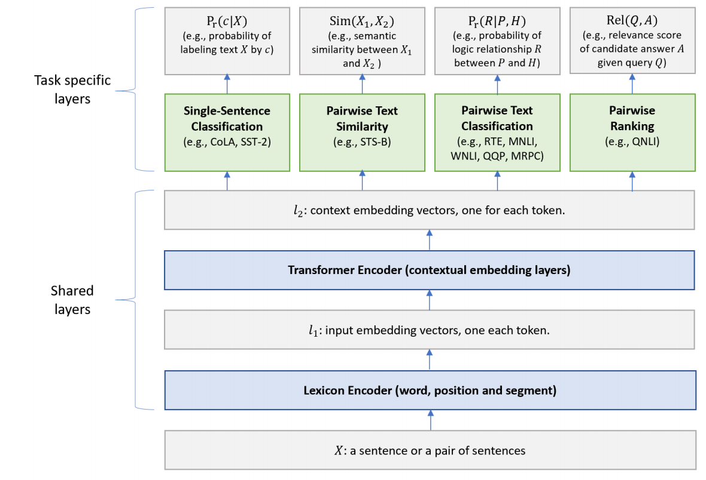
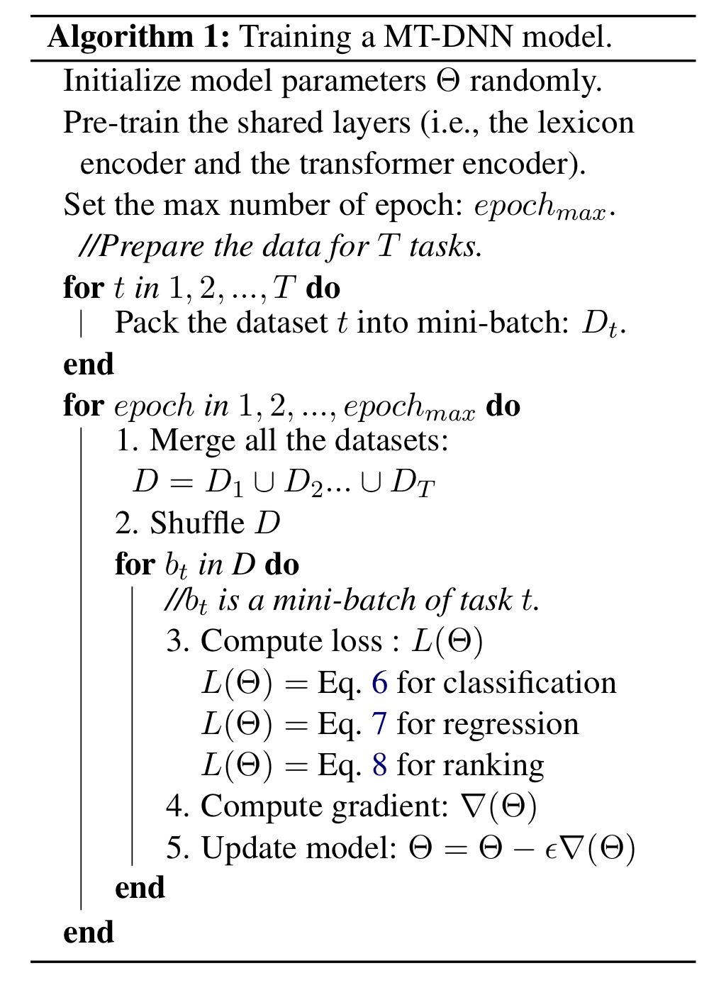
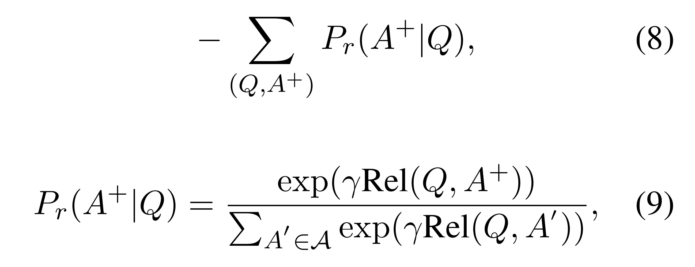
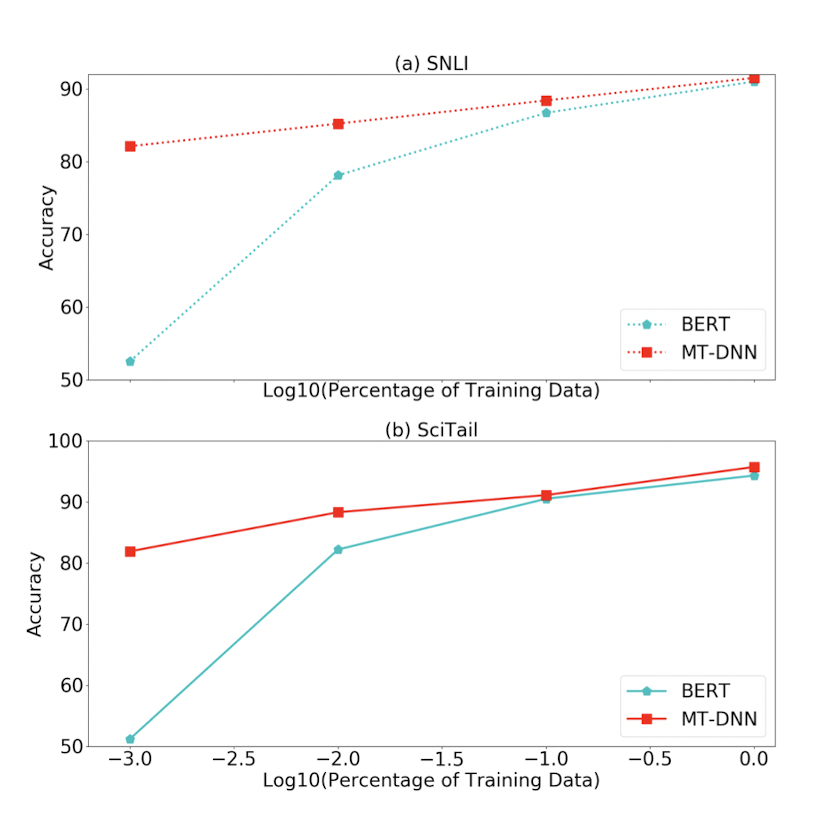
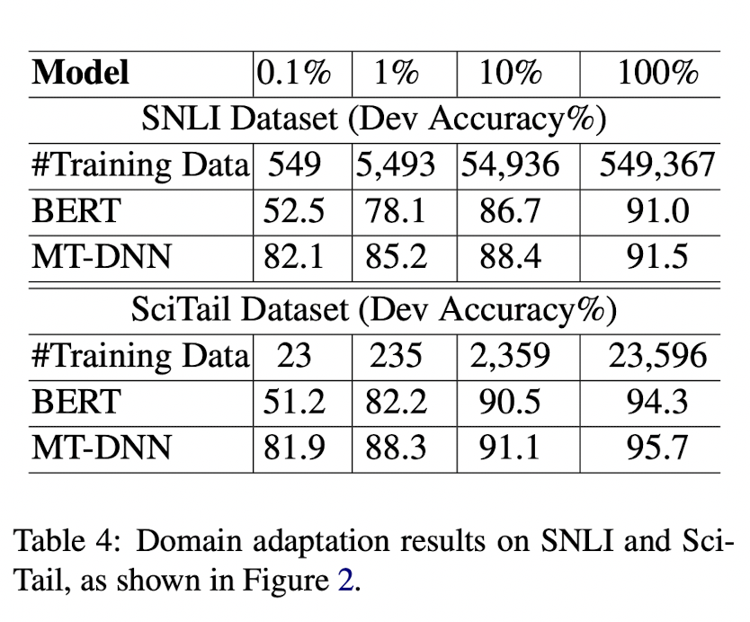
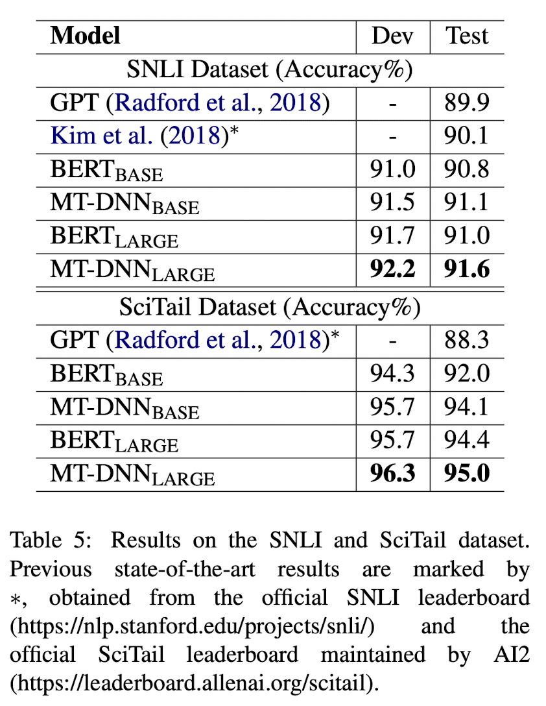

# MT-DNN 논문요약

Date: May 12, 2021 → May 16, 2021  
Assign: 김유진, 이상민, 한유경, 송경민, 문예진  
Status: Completed

> 논문 정리 역할 분담  
> 1 ~ 2  이상민  
> 3 김유진    
> 3.1 ~ 4.1 송경민  
> 4.2 ~ 4.3 한유경  
> 4.4 ~ 4.5 문예진  

# 1. Introduction
기본적으로 BERT를 개선한 모델!

## Abstract

MT-DNN은 BERT에 Multi-task learning(GLUE TASK 9개 활용)을 수행하여 성능 개선한 모델

- 다양한 Task의 Supervised Dataset을 모두 사용하여 대용량 데이터로 학습
- Multi-task Learning을 통해 특정 Task에 Overfitting되지 않도록 Regularization

다음 Task에서 SOTA 성능(BERT보다 높음)

- 8개의 GLUE Task
- SNLI와 SciTail Task로 Domain Adaptation : Fine Tuning 데이터가 적을 때에도 Classification 정확도가 꽤 높음

## Language Representation

: nlp에서 word 혹은 sentence의 vector representation을 생성하는 방법 두가지

Language Model Pre-Training

- unlabeled dataset을 활용한 학습 방법
- 대표적으로 문장에서 특정 단어를 맞추는 방식으로 Unspervised Learning
- ELMO, BERT 등등

Multil-task learning

- 여러 Task의 Labeled Dataset을 활용하여 1개의 모델 Supervised Learning
- 어떤 Task에서 학습 효과가 다른 Task의 성능에 영향을 미칠 것이라는 가정 : ex) 스키를 잘 타는 사람이 스케이트를 잘 탈 수 있다.

## Language Model Pre-Training - BERT

Book Corpus, Wikipedia Data를 활용하여 다음 2가지 방식으로 학습

Masked Word Prediction

- 문장이 주어졌을 때 특정 Word를 Masking하고 다른 주변 Word들을 활용하여 해당 Word를 예측하는 방식으로 학습 : ex) my dog is [Mask] → my dog is hairy

Next Sentence Prediction

- 문장이 2개 주어졌을 때, 2개의 문장이 연결된 문장인지 아닌지를 Classification하는 방식으로 학습 : ex) Input = the man went to the store [SEP] he bought a gallon of milk → IsNext

## Multi Task Learning

Supervised Task를 1개의 모델을 통해 학습

- GLUE의 9개 Task 활용 #얘를 한 모델을 통해 한꺼번에 학습하는 것이 본 논문의 메인 아이디어

MTL의 이점

- 대용량 Supervised Dataset을 활용하여 학습 가능
- 모델이 특정 Task에 Overfitting되지 않도록 Regularization 효과를 줄 수 있음

# 2. Tasks

9개 glue 태스크를 본 논문에서는 다음의 4가지로 분류

## Single Sentence Classification

하나의 문장이 Input으로 주어졌을 때 class를 분류하는 Task - CoLA(문장이 문법적으로 맞는지 분류), SST-2(영화 Review 문장의 감정 분류)

## Text Similarity

문장 쌍이 주어졌을 때, 점수를 예측하는 Regression Task - STS-B(문장 간의 의미적 유사도를 점수로 예측)

## Pairwise Text Classification

문장 쌍이 주어졌을 때, 문장의 관계를 분류하는 Task - RTE,MNLI(문장 간의 의미적 관계를 3가지로 분류 : Entailment, Contradiction, Neutral), QQP,MRPC(문장 간 의미가 같은 여부를 분류)

## Relevance Ranking

질문 문장과 지문이 주어졌을 때, 지문 중 정답이 있는 문장을 Ranking을 통해 찾는 Task - QNLI(질문, 지문 중 한 문장이 쌍으로 주어졌을 때 해당 지문 문장에 질문의 답이 있는지 여부 분류 → MT DNN에서는 이를 Rank 방식으로 바꾸어 모든 지문 문장에 정답이 있을 가능성을 점수화하여 가장 높은 지문 문장만을 True로 분류함)  
이 4개로 분류된 9개 태스크를 mt dnn 이 버트라는 하나의 모델로 학습해서 성능을 높였다는 것이 본 논문의 핵심 아이디어

# 3. The Proposed MT-DNN Model

**MT-DNN model의 구조** 

하위 layer(BERT의 Transformer 구조와 동일)는 모든 task에 공유되고, 가장 상위의 레이어는 task별로 다르게 구성. 

shared layer는 버트와 동일, task specific layer는 버트와 같은것도 다른것도 있음

**Lexicon Encoder ($l_{1}$) :** 

BERT의 임베딩 방식과 동일. X = {x1, ..., xm} sequence가 input으로 들어오면 Embedding vector로 바꿔줌. 

인풋을 생성하는 layer 로 ~~의 세가지 임베딩으로 구성

token embedding 각 토큰에 대한 임베딩

sentence~ : 첫번째 문장인지 두번째 문장인지를 알려주는 임베딩

position~ : 각 토큰의 위치에 대한 임베딩

이런식으로 인풋이 형성이 되면 이를 트랜스포머의 셀프어텐션에 넣어  각 토큰의 임베딩 벡터를 추출함

**Transformer Encoder ($l_{2}$)  :**

Lexicon Encoder ($l_{1}$) 의 임베딩 벡터를 입력으로 받아서 multilayer bidirectional Transformer encoder 를 사용하여 각 Token의 Output Vector를 추출함. 이때 BERT에 더해서 MT-DNN 은 multi-task objectives를 사용하여 학습함. 

**Single-Sentence Classification Output #버트와 같은 레이어**

Transformer Encoder ($l_{2}$) 로부터 얻은 output vector의 [CLS] 토큰은 contextual embedding 을 진행한 벡터로 볼 수 있음. 

하나의 문장을 분류하는 Classification Output은 다음과 같이 계산

: `[CLS] Token`과 `Task Specific Parameter`의 곱에 Softmax를 취하여 각 Input Sentence `X`가 각 class에 속할 확률을 계산

- $W^T_{SST}$ : Task specific Parameter
- x :  Input Sentence

**Text Similarity Output : #위와 비슷 리그레션이니까 sigmoid로 바꾼 것**

Transformer Encoder ($l_{2}$) 로부터 얻은 output vector의 [CLS] 토큰은 문장쌍 (X1,X2)의  semantic representation으로 볼 수 있음. 

Sentence pair로 이루어진 (X1, X2)의 유사도는 다음과 같이 계산

- $w^T_{STS}$ : Task Specific Parameter

**Pairwise Text Classification Output :**

NLI task를 예로 들면, 전제 premise P = (p1, ..., pm) 와 가설 hypothesis H =
(h1, ..., hn) 이 있을 때, 이 둘의 논리적 관계인 R을 찾는 것이 목적. 이를 위해 stochastic answer network (SAN)을 사용하는데,  RNN을 이용하여 K-step Reasoning을 하는 것이 특징

#두 문장이 있을 때 한번에 문장 간 관계를 분류하기가 쉽지 않음 . 여러 단계가 필요하겠다는 것이 main idea

각 K step 마다, 

- $s^k;x^k$  : 각 문장의 vector
- $|s^k-x^k|$ : 문장간 거리
- $s^k\cdot x^k$ : 문장간 유사도

두 문장 자체의 Embedding Vector, 그리고 두 문장 간 관계(차의 크기와 Dot Product)를 concat하여 구성된 Vector를 활용하여 문장 간 관계를 분류

→ 최종적으로 모든 K step에서 나온 output vector를 평균

**Relevance Ranking Output :**

QNLI task를 가정하면, 다음과 같이 relevance score을 계산

- (Q , A) : input sentence pair
- `x` : the contextual embedding vector of [CLS] which is the semantic representation of a pair of Question
- $g$ : sigmoid 함수
- $w^T_{QNLI}$ : Task specific parameter

## 3.1 The Training Procedure

MT-DNN은 훈련 절차

- Pretraining
- BERT의 모델을 따름.
- lexicon encoder와 Transformer encoder의 파라미터는 mask language modeling과 next sentence prediction 이 두가지의 unsupervised prediction tasks에 의해 학습됨.
- Multi-task learning
- 모델의 파라미터를 학습하기 위해 SGD 기반의 mini-batch를 사용.
(선택하는 방법은 모든 task(9개의 GLUE)의 데이터세트를 모아다가 batch를 끄집어내는 식) 
- 각 epoch마다 미니배치 b_t가 선택되고 task t에 대한 task-specific objective에 따라 모델이 업데이트됨.
→ 모든 다중 작업 목표의 합계를 거의 최적화함

- classification task에서는 cross-entropy loss를  사용함.

- 1((X,c)는 이진수 표시기( 맞는 class이면 1, 아니면 0)
- Pr은 위의 식 1,4에 정의됨

- text similarity tasks(ex.STS-B)에서는 각 문장쌍이 실제 값 점수 y로 명시되어 있으면 MSE를 사용함.

- Sim은 위의 식 2에서 정의됨

- relevance ranking tasks에서는 pairwise learning-to-rank 패러다임 사용함.
QNLI를 예로 들면 쿼리 Q가 주어지면, 정답을 포함하는 긍정적인 예 A+와 |A|-1개의 부정적인 예를 포함하는 후보 답변 목록을 얻음. (8)

    

    (9) Rel은 위의 식 (5)에서 정의됨.
    r(감마)은 tuning factor로 데이터에 따라 결정되며 이 실험에선 단순히 1로 정한다.

    A=A+∪A− (A+: 정답, A−: negative sample)
    다른 후보들에 비해 정답이 가장 큰 확률을 갖도록 정답 확률의 negative log likelihood를 최소화하는 방향으로 학습.

# 4. Experiments

GLUE, SNLI, SciTail의 세가지 인기있는 NLU 벤치마크에서 MT-DNN을 평가한다.

## 4.1 Datasets

- GLUE(General Language Understanding Evaluation)
: 질의 응답, 정서 분석, 텍스트 유사성 및 텍스트 수반을 포함한 9개의 NLU 과제 모음 
NLU 모델의 일반화와 견고성을 평가하기 위해 설계됨
- SNLI(Stanford National Language Inference)
: 570k 개의 human annotated 문장쌍이 포함되어 있음. NLI에 대해 가장 많이 사용됨
이 논문에서 Domain adaptation을 위한 데이터세트로 사용
- SciTail
: SciQ(과학 질의응답) 데이터셋에서 도출된 텍스트 수반 데이터셋
주어진 전제가 주어진 가설을 포함하는지 여부를 평가하는 것을 포함
언어학적으로 어려운 내용이기 때문에 challenge함
이 논문에서 Domain adaptation을 위한 데이터세트로 사용

## 4.4 Domain Adaptation Results on SNLI and SciTail

실험 방법
1. MT-DNN or BERT를 initial model로 함(base, large 모델 세팅 포함)
2. task-specific training data로 학습된 MT-DNN을 적용시켜서 SNLI, SciTail 각각에 맞는 모델을 만듦
3. task-specific test data로 평가

Figure 2

실험결과
- 더 적게 train할수록 MT-DNN 더 성능 발달
- BERT보다 domain adaptation에 일관되게 효과적임

Adapted model을 비교해본 결과, 다른 모델에 비해 MT-DNN(LARGE)가 두 데이터셋에서 모두 SOTA 상태.

# 5 Conclusion

MT-DNN

- MTL과 Language representation learning을 위한 LM pre-training을 접목시킨 것
- SNLI, SciTail, GLUE에 대해 10개 NLU task에서 SOTA의 결과를 냄
- Domain adatation 실험에서 일관되게 좋은 결과.