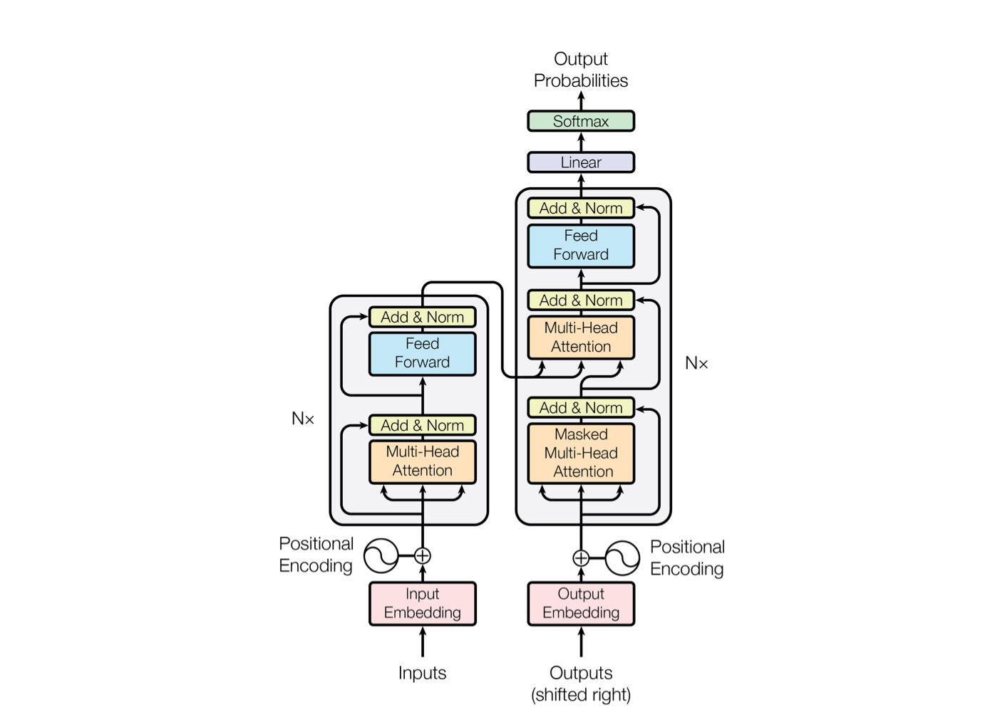
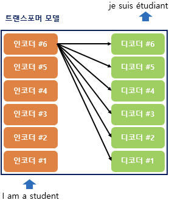
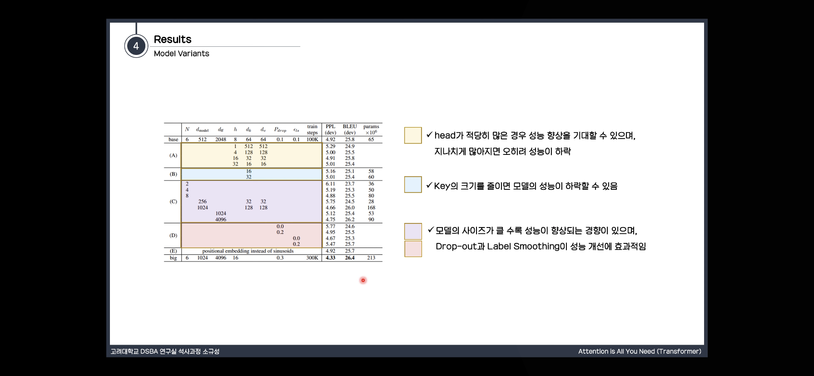

# Transformer 논문요약

날짜: Apr 1, 2021 → Apr 4, 2021  
배정: 김유진, 이상민, 한유경, 송경민, 문예진  
상태: 완료

> 논문 정리 역할 분담  
> 1 ~ 3.1 문예진  
> 3.2 이상민  
> 3.3 ~ 3.5 한유경   
> 4 ~ 5 송경민  
> 6 ~ 7 김유진  


# 1. Introduction
RNN, LSTM, Gated RNN이 sequence modeling에서 많이 사용됨.

(1) Recurrent model
- symbol position에 따라서 계산
- token 정보 정렬 후 hidden states $h_t$ 업데이트 하면서 계산하게 됨
- 연속적으로 이어지는 것이기 때문에, 병렬 처리도 힘듦 + 긴 문장에서는 그만큼 NN의 input에 넣어줘야 해서 메모리적 한계가 있음

(2) [Attention](https://wikidocs.net/22893)
- 시퀀스 모델링과 변형 모델에서 중요한 역할
- 입력이나 출력 sequence의 거리에 상관 없이 단어간 관계를 연결하는 모델링 가능
- 출력 정보 중 어떤 정보가 중요한지 가중치 부여 → $h_t$에 곱해서 결과 계산

(3) Transformer
- recurrence 빼고 Attention에 전적으로 의지해서 입력과 출력간 관계 인식
- Attention) 한 번의 행렬 곱으로 위치 정보가 포함된 시퀀스 한 번에 계산 ⇒ 병렬 처리 가능(순차 ㄴ)


# 2. Background
(1) Extended Neural GPU, ByteNet, ConvS2S
- 시퀀스 계산 줄이기
- CNN 사용 + 모든 입력, 출력 위치에 대해 은닉값 병렬처리
- 임의의 두 입력, 출력 위치를 연결하기 위한 signal 있음 → 거리에 따라 선형증가(ConvS2S) or 로그증가(ByteNet)
- 멀리 있는 애들끼리 연관성? 따지기 어려움
⇒ Transformer에서는 Multi-Head Attention으로..

(2) **[Self-attention](https://wikidocs.net/31379) (= Intra-attention)**
- target 문장을 만들기 위해 소스 문장의 hidden 정보를 참고하는 것이 아니라
- 한 시퀀스가 있을 때, 그 안에 있는 서로 다른 위치 정보가 서로에게 가중치를 줌 → 한 시퀀스에 대한 representation을 효과적으로 쓸 수 있게!
    ex) I am a teacher → 4 단어가 서로서로 attention


# 3. Model Architecture
*이전 seq2seq 구조에서는 인코더와 디코더에서 각각 하나의 RNN이 t개의 시점(time-step)을 가지는 구조. 여기는 인코더와 디코더라는 단위가 N개로 구성되는 구조



### 3.1 Encoder and Decoder Stacks



(1) Encoder

- 각 단어의 위치 정보를 encoding해서 원래 임베딩한거랑 합체 = input
- Multi-Head attention: self-attention을 병렬적으로 사용하였다!
- [Multi-Head self-Attention 도착해서 어텐션 수행 → residual connection & 정규화 → Feed-Forward 도착 → resid. connection & norm → output] 이걸 N = 6번 수행
- 각 sublayer의 결과 값? $LayerNorm(x + Sublayer(x))$
- $Sublayer(x)$: sublayer에서
- 입출력 dimension $d_{model} = 512$

(2) Decoder

- 주로 encoder layer 수와 같음 (N = 6)
- Encoder 구조 + 뒤에 오는 단어를 미리 알지 못하게(앞에 있는, 아는 단어로만 예측했다고 확실히 하기 위해서) masking한 attention layer
- Multi-Head Attention layer에서는 Encoder의 output stack을 참고함(매 encoder-decoder attention에서)

### 3.2 Attention


Attention에는 Query, Key, Value가 있다. ex) i love you

Query는 값을 구하고자 하는 단어 (i)

Key는 해당 문장의 모든 단어 (i, love, you)

Value는 말 그대로 값 (0.3, 0.2, 0.1)

Quey와 Key의 곱 수행 → 정규화(Scale) → 원하는 부분 연산x(Mask) → 확률화(SoftMax) → Value와 곱

### 3.2.1 Scaled Dot-Product Attention


Query, K를 곱합(차원이 같음) → dk로 나눠서 스케일링 → softmax → value와 행렬곱

additive attention(함께 입력되도록)와 다른점이 쿼리와 키가 서로 곱하도록 만들어서 내적을 이용함(빠르고 공간효율적)

sotmax는 중간이 크고 사이드가 작아지므로 특성 스케일팩터만큼 곱해서 값을 작게 만들어 학습이 잘 되도록

### 3.2.2 Multi-Head Attention


head를 이어붙이고 concat를 통해 차원을 갖게 만듦. 쿼리 키 밸류를 모두 같에 64차원으로 활용.

### 3.2.3 Applications of Attention in our Model

encoder-decoder attention : 디코더 파트에서 사용. 쿼리는 디코더에서. 키와 밸류는 인코더의 출력값에서 가져옴. 쿼리에서 어떤 부분에 초점을 맞추는지가 특성.

self attention : 쿼리 키 밸류가 서로 연산하여 수행

decoder : 마스크(-무한대)를 씌움. 각각의 단어가 앞부분의 단어만 사용

### 3.3 Position-wise Feed-Forward Networks

- encoder, decoder의 각 attention sub-layer는 fully connected feed-forward network를 포함함

→ position 마다 독립적으로 적용되므로 position-wise 

- 두 개의 선형 변환과 ReLU activation function으로 구성됨

                                                 **FFN(x)=max(0,xW1+b1)W2+b2**

                              (x에 선형 변환을 적용한 후 ReLU를 거쳐 다시 선형 변환)

- 선형 변환은 position마다 같은 parameter를 사용하지만 layer가 달라지면 다른 parameter 사용
- input과 output의 차원 : $d_{model}$=512

      inner-layer의 차원 : $d_{ff}$=2048

### 3.4 Embeddings and Softmax

- 다른 sequence transduction model과 마찬가지로, input과 output token을 $d_{model}$ 차원을 갖는 벡터로 변환하여 embedding을 학습
- decoder의 output으로 next-token 확률을 예측하기위해 학습가능한 선형변환과 소프트맥스 함수 사용
- 논문의 모델에서는 두 embedding layer와 softmax 이전의 linear transformation에서 동일한 weight 행렬을 공유함

→ embedding layer에서는 weight에 $\sqrt{d_{model}}$을 곱하여 사용

### 3.5 Positional Encoding

- Transformer 모델은 recurrence나 convolution을 포함하지 않음

→단어의 앞 뒤 순서정보를 가지고 있지 않음

- 따라서 sequence의 순서성을 이용하기 위해, position에 대한 정보를 sequence의 token에 주입해야 함

→ encoder와 decoder의 input embedding에 “positional encoding”을 더해준다. 

- positional encoding은 embedding과 더해질 수 있도록  dmodel 차원을 가짐
- 논문에서는 다른 frequency의 sine, cosine 함수를 사용함

                                                      **PE(pos,2i)=sin(pos/100002i/$d_{model}$)**

                                                   **PE(pos,2i+1)=cos(pos/100002i/$d_{model}$)**

                                                (pos : 토큰의 위치 인덱스, i : 벡터의 차원 인덱스)

# 4. Why self-Attention

self-attention을 사용하면 얻는 이점 3가지

1. 각각 Layer 당 계산 복잡도가 줄어든다.
2. 병렬로 처리할 수 있는 계산이 늘어난다.
3. RNN보다 더 먼 거리에 있는 sequence를 잘 학습할 수 있다.


n=단어의 개수, d=representation의 차원
보통 n<d

위 표에서
complexity per Layer : 보통 n<d이기 때문에 Self-Attention이 Recurrent보다 유리한 복잡도를 가짐
Sequential Operations : self-attention이 더 유리함.(1번에 병렬적 처리가 가능하기 때문에 RNN보다 네트워크에 들어가는 횟수가 적음)
Maximum Path Length : 장거리 의존성의 학습 속도에서 self-attention이 가장 좋음

추가적으로, self-attention은 더 해석 가능한 모델을 만듦

# 5. Training

### 5.1 Training Data and Batching

4.5M개의 문장 쌍이 있는 WMT 2014 English-German dataset과 36M개의 문장 쌍을 포함하는 WMT 2014 English-French dataset 사용

### 5.2 Hardware and Schedule

8개의 NVIDIA P100 GPU가 있는 한 개의 기계에서 모델을 훈련시킴

base model에선 각 training step 마다 0.4초 걸렸고 12시간 동안 학습함

big model의 경우엔 1초가 걸렸고, 300,000steps 학습시킴

### 5.3 Optimizer

Adam optimizer 사용(파라미터 β1=0.9, β2=0.98, ε=10^-9)

식에 따라 변화하는 learning rate 사용


위 식에서 learning rate는 첫번째 warmup_steps동안 step_num 에 비례하여 선형적으로 증가, 그 이후로는 step_num step_num의 역제곱근에 비례하여 감소

논문에서는 warmup_steps=4000을 사용함

### 5.4 Regularization

- **Residual Dropout**
sub-layer의 각  output이 sub-layer의 input이나 normalized되기 전에 dropout 적용
추가적으로 encoder와 decoder stacks 사이에 embeddings와 positional encodings를 더하여 dropout 적용
base model 에선 0.1 사용함
- **Label smoothing**
학습이 진행되는 동안  ϵls=0.1값을 갖는 label smoothing 적용
모델이 특정 출력값에 대해 확신을 가지지 않도록하여 accuracy와 BLEU score를 높힘

# 6. Results


## 6.1 기계 번역 (Machine Translation)

WMT 2014 English-to-German translation task : `Transformer (big)` 모델이 28.4로 기존 SOTA 모델보다 2.0 이상 높은 BLEU score을 기록. `base model` 도 이전 모든 모델을 능가하는 성능을 보임.

WMT 2014 English-to-French translation task : `Transformer (big)` 모델이 이전 모델의 1/4 미만의 training cost 만으로도 BLEU score 41.0 달성

⇒ 학습 효율은 높고, 성능은 더욱 개선되었음을 알 수 있음.

## 6.2 Model Variations

Transformer 모델 components의 중요도를 평가하기 위해 base model을 다양하게 변형해봄. (English-to-German translation task의 performance 변화를 측정)




정량적 모델 평가

(A) attention `head`의 개수를 변화 ( $d_{model}$ 을 head로 나눠서 $d_k$와 $d_v$값을 만들기 때문에 $d_k$와 $d_v$ 도 같이 변화) → h = 8일때(baseline)가 가장 성능이 좋음

(B) $d_k$  값을 줄이면 모델 성능 하락

(C) 모델의 크기를 키우면 성능 향상 

(D) drop-out 사용이 오버피팅 방지에 효과적 → 성능 향상

(E)  위치에 대한 정보를 주기 위해 사인-코사인 함수를 이용한 인코딩(sinusoids) 대신 별도의 embedding layer를 사용했을 때 baseline과 비슷한 성능을 보임.

## 6.3 English Constituency Parsing (구문 분석)

- → 참고) 구문분석 이란? :

    > **Constituency parsing**

    > Constituency parsing aims to extract a constituency-based parse tree from a sentence that represents its syntactic structure according to a [phrase structure grammar](https://en.wikipedia.org/wiki/Phrase_structure_grammar).

    Example:

    ```bash
    Sentence (S)
                     |
       +-------------+------------+
       |                          |
     Noun (N)                Verb Phrase (VP)
       |                          |
     John                 +-------+--------+
                          |                |
                        Verb (V)         Noun (N)
                          |                |
                        sees              Bill
    ```

Transformer가 번역 뿐만 아니라 다른 자연어처리 task까지 일반화 가능한지 알아보기 위해 English constituency parsing task에 대해 실험을 수행. 

English constituency parsing : 강한 구조적 제약, input보다 훨씬 긴 output을 가짐 + RNN sequence to-sequence model 은 작은 dataset으로는 SOTA를 달성할 수 없었음.


- 별도의 tunning 없이도 이전 모델 대부분에 대해서 더 좋은 성능을 보여줌. (Recurrent Neural Network Grammar [8] 제외)
- RNN sequence-to-sequence models [37] 와 대조적으로, 40K 문장만 training set으로 이용한 WSJ 에서도 성능이 잘 나옴. (↔ [37]은 성능이 확 떨어짐)


# 7. Conclusion

본 논문에서는 

1. Transformer model 제안 (오직 attention만 사용한 최초의 시퀀스 변환 모델)
2. 번역 task에서 RNN 이나 CNN을 사용한 모델보다 훨씬 빠르게 학습 가능
3. 다른 자연어처리 task로도 확장 가능
4. 코드 구현 https://github.com/tensorflow/tensor2tensor
