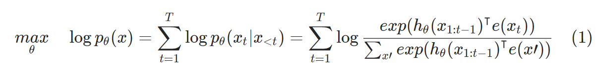
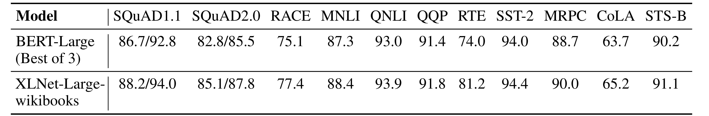
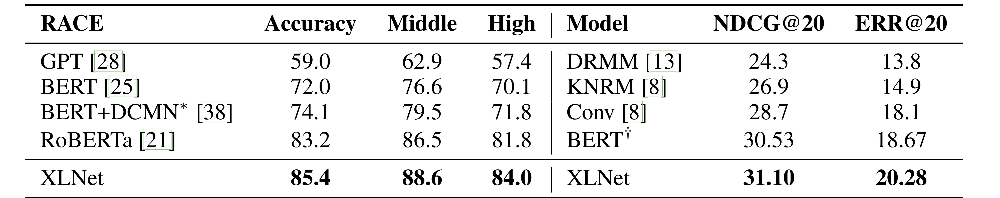
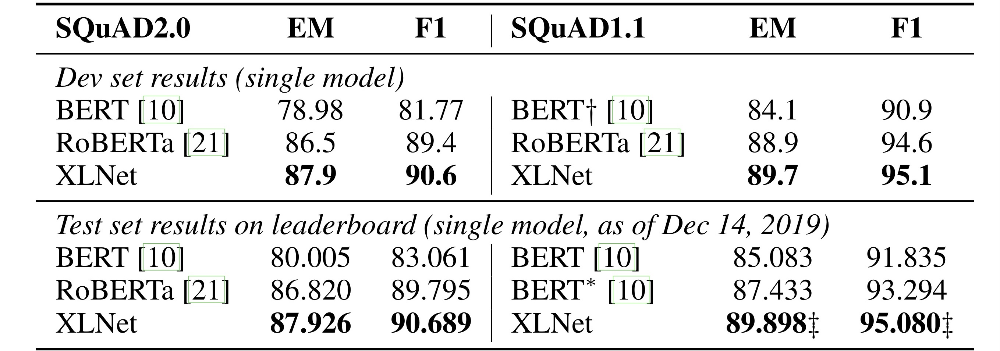
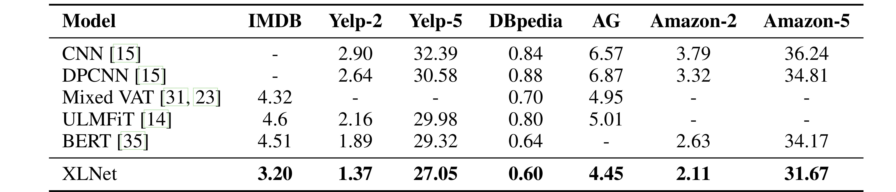
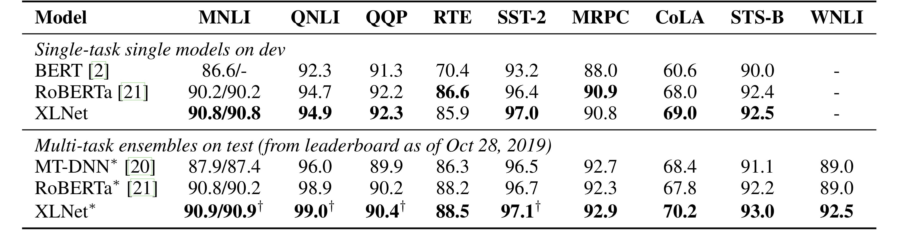
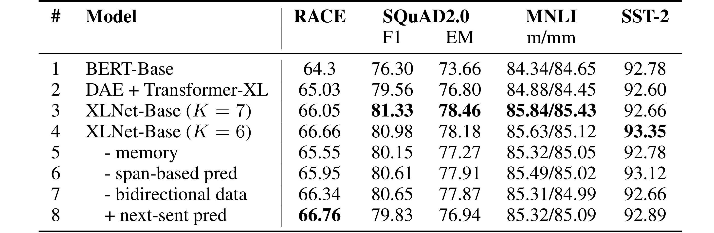

# XLNet 논문 요약

Date: Apr 25, 2021 → May 8, 2021  
Assign: 김유진, 이상민, 한유경, 송경민, 문예진  
Status: Completed

> 논문 정리 역할 분담  
> 1 문예진  
> 2.1 ~ 2.2 한유경  
> 2.3 이상민  
> 2.4 ~ 2.6 김유진  
> 3 ~ 4 송경민     

# 1. Introduction
### AR(GPT), AE(BERT) 문제점

AR(AutoRegressive) language model
- 앞의 token을 이용해 문장의 확률 분포를 알아냄
- 순방향(forward)든 역방향(backward)든 단방향 context
- bidirectional context 정보가 필요할 때에는 적합하지 않음

AE(AutoEncoding) based LM = BERT
- 망가진 입력값으로부터 원본을 재구성하는데에 목표로 함 (input sequence의 특정 부분에 `MASK` 적용)
- bidirectional context 사용하기 때문에 성능 향상
- 하지만 `MASK`가 pretrain에서는 사용되는데 finetuning에서는 사용되지 않음 = 불일치 문제 발생
- 예측 token이 `MASK`처리 되어 있어서 AR language modeling에서처럼 joint probability 계산 불가
    = predicted token과 unmasked token이 서로 독립적이다
    = high-order & 장거리 의존성 있는 자연어를 너무 단순화 시켰다는 것

### XLNet

: AR과 AE를 최대한 활용할 수 있는 generalized AR method  
: permutation-based (AR) language modeling

- 인수분해 순서에 따른 모든 가능한 순열에 대해 sequence의 log likelihood를 최대화  
    → 각 위치에 대한 문맥은 양방향 모두 학습 "capturing bidirectional context"  
- 데이터 손상에 의지하지 않음 = pretrain-fintune 일치  
    → joint probability 계산 가능(token의 독립적 추정 ㄴㄴ)
- pretraining 설계 개선
    1. Transformer-XL의 segment recurrence mechanism & relative encoding scheme을 pretraining에 적용  
     → 긴 text sequence를 갖는 task 성능 향상
    2. Transformer(-XL)을 reparameterize하여 target의 모호성 제거  
        → Transformer? 인수분해(factorization) 순서 무작위 & target 모호함 = XLNet에 적용하기 어려움

  
# 2. Proposed Method

## 2.1 Background

AR language modeling과 BERT의 language model pre-training을 비교

- text sequence X = [X1,X2....,Xt]가 주어지면 다음 식의 likelihood를 maximizing하는 방향으로 pre-traing을 진행한다.

    

- $h_{\theta}(x)$ : RNN 또는 transformer와 같은 neural model로부터 생성된 content representation e(x) : embedding
- BERT는 text sequence x에 대해 token 일부(e.g., 15%)를 **[MASK]** 로 설정함으로써 손상된 x_hat 를 구성한다. masked token을 x_var 라 할때 training objective는 x_hat로부터 x_var 를 재구성하는 것이다.

    

- m_t = 1 이면 x_t는 `MASK` 이며, H theta 는 length-T text sequence x로 부터 transformer 를 통해 얻어지는 hidden vector H_theta(x) = [H_theta(x)1, H_theta(x)2, ..., H_theta(x)T] 이다.

 

두 가지 pre-train의 장단점을 비교  
 - **Independence Assumption:** BERT는 마스킹된 token *x*가 독립되게 재구성된다는 가정에 기초하여 joint conditional probability *p*(*x*∣*x*^)를 인수분해 한다. 반면에 AR language modeling은 식1과 같이 곱의 규칙을 사용하여 *pθ*(*x*)를 인수분해 한다.
 - **Input noise:** BERT의 input에는 downstream task에서는 사용하지 않는 `MASK`와 같은 symbol이 사용되기 때문에 pre-train과 fine-tune간에 차이가 발생한다.
 - **Context dependency:** AR representation *hθ*(*x*1:*t*−1) 는 위치 *t*까지의 token에 대해서만 계산되지만 반면에 BERT representation *Hθ*(*x*)*t*는 bidirectional contextual information에 접근할 수 있다. 결과적으로 BERT는 bi-directional context를 더 잘 capture할 수 있도록 pre-train된다.

## **2.2 Objective: Permutation Language Modeling**

- AR language modeling과 BERT는 다른 language modeling보다 고유한 장점을 가지고 있는데, 단점을 피하면서 둘의 장점을 가져오는 pre-training objective에 초점을 맞춤
- [orderless NADE](https://arxiv.org/abs/1605.02226)에서 아이디어를 차용하여 AR model의 장점을 유지하고 model이 bi-directional context를 capture할 수 있도록 permutation language modeling objective를 제안
- 길이가 T인 시퀀스 x에 대해 T!만큼 autoregressive 인수분해를 수행하여 model parameter들이 모든 인수분해 순서들에 걸쳐 공유되면, model은 양측의 모든 위치에서 정보를 모으는 방법을 train하게 됨
- *ZT*는 길이 *length*−*T*의 index sequence [1,2,...,T]의 모든 가능한 permutation 집합이라 정의한다. *zt*와 *z*<*t*를 사용하여 permutation *z*∈*ZT*의 t번째 element와 첫 번째 element *t*−1를 나타낸다
- 제안하는 permutation language modeling은 다음과 같이 표현할 수 있다.

text sequence x에 대해 인수분해 순서 z를 sampling하고 인수분해 순서에 따라 likelihood *pθ*(*x*)를 decompose 한다. 동일한 parameter *θ*가 공유되어 학습되는 동안, *xt*‘는 *xi !*= *xt*인 모든 element를 보기 때문에 bi-directional context를 capture할 수 있다.

- **Remark on Permutation:** 제안하는 방식은 sequence 순서가 아닌 인수분해 순서만 바꾼다. 즉 원래의 sequence 순서를 유지하고 원본 sequence에 해당하는 positional encoding을 사용하여 인수분해 순서 permutation에 해당하는 attention mask를 얻는다.

## 2.3 Architecture: Two-Stream Self-Attention for Target-Aware Representations

permutation language modeling을 기존 transofrmer에 적용하기는 어려움이 있다. 그래서 softmax를 사용하여 next token의 distribution p를 parameter화 함. h는 masking 후 transformer로부터 생성된 x의 hidden representation을 의미하는데, zt가 식에 없음(의존성이 없음). 결과적으로 유용한 representation을 배울 수 없는 위치에 상관없이 동일한 distribution 예측. 그래서 아래와 같이 next-token의 distirubtion이 target postion을 인식할 수 있게 재구성

제안하는 수식을 transformer architecture에 사용할 수 없는 두 가지 이유가 있다. 첫 번째는 toekn xzt, g세타 를 예측하기 위해 postion zt만 사용해야 한다. context xzt를 사용하면 objective는 너무 간단해짐. 두 번째는 j > t일 때 다른 token xzj를 예측하기 위해 xzt는 완전한 context information을 제공하기 위해 content를 encoding 해줘야 함.

(a) : content stream attention : 예측하고자 하는 토큰의 실제 값 정보를 같이 사용하여 예측 / z는 원래 문장 순서를 random shuffle한 index list, zt는 z의 t번째 요소

(b) : query stream attention : 토근, position 정보를 활용한 self attetnion 기법. 예측하고자 하는 target토큰 이전 정보들의 값(postion embedding, random initialization)을 가지고 예측

Parital Prediction

permutation languagemodeling은 순열로 인해, 최적화가 어렵고 수렴이 오래걸린다. 최적화의 어려움을 해결하기 위해 인수분해 순서에서 마지막 token만 예측하고 z를 non target subsequence(z≤c)와 target subsequence(z>c)로 분할한다. 목적은 non target에서 targe의 log-likelihood를 maximize하는 것이다.

usselected token들을 query representation이 계산되지 않기 때문에 메모리를 아끼고 속도를 향상시킬 수 있다.

## 2.4 Incorporating Ideas from Transformer-XL

transformer-XL에서 사용되는 두가지 중요한 기술 `relative positional encoding scheme`과 `segment recurrence mechasnism`을 pre-training framework에 포함시켰다.

긴 sequence에서 x˜ = s1:T 와 x = sT +1:2T 두개의 segment를 입력으로 받으며, z˜ 와 z의  [1 · · · T] 와 [T + 1 · · · 2T]의 permutation이라고 가정한다. 

z˜를 통해 첫번째 segment를 계산하고, 각 layer m에 대해 얻어진 content representation h˜(m) 를 캐싱한다. next segment x에서 memory를 포함하는 attention update는 다음과 같다. 

[.,.]은 sequence dimension사이에 concatenation 의미한다. positional encoding은 original sequence의 실제 position에만 의존하기 때문에 ${ \tilde { h } }^{ (m) }$이 계산되면 $\tilde { z }$와는 독립적이다. 이롤 통해 previous segment의 인수분해 순서에 대한 정보 없이 memory 를 caching하여 다시 사용할 수 있다. model은 last segment의 모든 인수분해 순서에대해 메모리를 활용하는 방법을 train한다고 추측한다. (자세한 그림은 부록 A.7 참고) query stream도 동일한 방법으로 계산할 수 있다. 그림 1(c)는 제안하는 permutation language modeling을 two-stream attention으로 보여주는 것이다.

## 2.5 Modeling Multiple Segments

XLNet이 autoregressive framework에서 multiple segment를 어떻게 pre-train하는지 설명한다. BERT와 마찬가지로 random하게 선택된 segment를 concatenation하여 하나의 sequence로 permutation language modeling을 진행한다. XLNet의 input은 [A,SEP,B,SEP,CLS] 이다. ablation study(Section 3.7참고)에 따라 XLNet-Large는 next sentence prediction을 수행하지 않았다.

**Relative Segment Encoding**

- architecture상으로 차이점은 BERT의 경우 word embedding에 각 position에 따라 absolute segment embedding을 적용하였고, XLNet은 transformer-XL에서 제안한 아이디어를 확장하여 relative segment encoding을 사용.
- sequence에서 *i*와 *j*인 position pair가 있고 *i*와 *j*가 같은 segment에 있을때, segment encoding ${ s }_{ ij }={ s }_{ + }$또는 ${ s }{ ij }={ s }{ - }$를 사용. *s*+ 와 *s*−는 각 attention head의 learnable model parameter.
- *i*가 *j*에 attend될 때, segment encoding ${s}_{ij}$는 attention weight ${ a }_{ ij }={ ({ q }_{ i }+b) }^{ \intercal }{ s }_{ ij }$를 계산하는데 사용되며, ${q}_{i}$는 query vector같은 standard attention operation이고, *b*는 learnable head-specific bias vector이다. 다음으로 value ${a}_{ij}$가 normal attention weight에 더해짐.
- **relative segment encoding은 두가지 이점이 있음.**
    1. relative encoding의 inductive bias는 일반화를 향상.
    2. absolute segment encoding을 사용하여 불가능한 두 개 이상의 segment가 있는 task에 대한 fine-tune 가능성을 열어줌.

## 2.6 Discussion

[New, York, is, a, city]라는 문장(sequence of words)이 주어졌을 때, BERT와 XLNet 모두 예측할 token으로 [New, York] 2개를 선택하여 log p(New York | is a city)를 maximize 해야 하는 상황을 가정하면, 

XLNet은 BERT에서 누락되는 (New, York) pair의 dependency를 capture할 수 있다. 예시를 통해 BERT는 (New, city)와 (York, city)와 같은 일부 dependency를 학습하지만 XLNet은 항상 동일한 대상에서 항상 더 많은 dependenct pair를 학습하고 “denser”한 효과적인 train을 하게 된다. 

# 3 Experiments
## 3.1 Pretraining and Implementation

- 13GB 텍스트를 결합한 BookCorpus와 English Wikipedia를 pretraining data로 사용
- Bert보다 10배 많은 데이터 사용
- 가장 큰 모델인 XLNet-Large는 BERT-Large와 같은 구조의 하이퍼파라미터 매개 변수를 가지므로 비슷한 모델 사이즈를 가짐

## 3.2 Fair Comparison with BERT

BERT와 XLNet을 공정한 환경에서 비교 (3가지의 가장 좋은 성능을 낸 BERT와 같은 데이터와 하이퍼파라미터로 학습된 XLNet을 비교)

모든 데이터셋에서 BERT를 능가함!

## 3.3 Comparison with RoBERTa: Scaling Up

RACE Dataset

GPT, BERT 앙상블 모델들보다 성능이 좋음!

SQuAD Dataset

Single model들 중에서도 최고 성능을 보임

Text Classification

오분류율도 모두 SOTA 달성!

GLUE Dataset

9개의 NLU task를 모은 데이터셋

9개 중 7개가 SOTA, 9개 모두 기존의 BERT보다 더 좋은 성능을 보임!

## 3.4 Ablation Study

Line1,2 : 기존 BERT에 Transformer-XL을 반영하면 성능이 좋아짐.  
Line 3,4 : BERT + Transformer-XL + Permutation LM 에서 성능이 더 좋아짐.  
Line 8 : RACE에서는 next-sent pred를 추가하는게 성능이 더 좋아짐.  

  

  
# 4 Conclusions

- XLNet은 AR pretrainig 방법을 일반화한 것으로, Permutation language modeling objective를 사용해 AR과 AE의 장점을 결합한 것이다.
- XLNet의 구조는 AR objective을 작업하는데 적용되고 Transformer-XL와 two-stream attention mechanism을 결합하여 설계되었다.
- 다양한 작업에서 이전 pretraining 목표들보다 상당한 개선을 달성했다.
